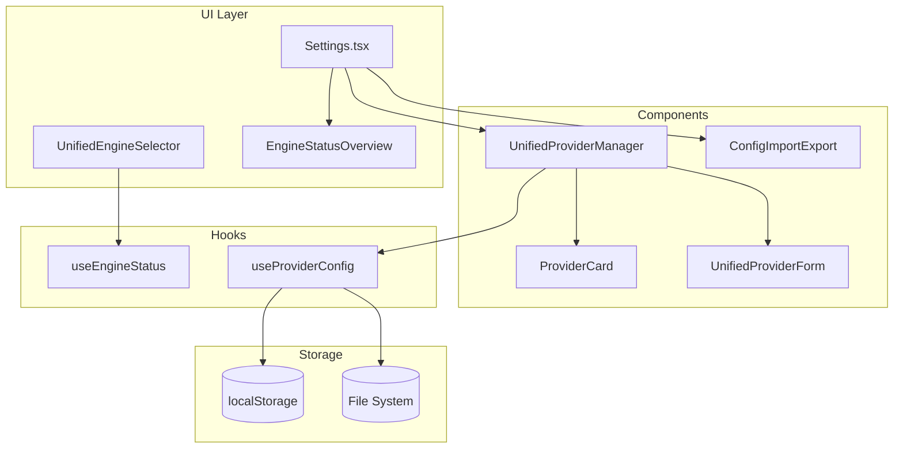

# Design Document: Engine Configuration Refactor

## Overview

本设计文档描述如何重构 Fangyu Code 的引擎配置系统，将分散的配置入口统一，消除重复代码，并提供更好的用户体验。

核心改进：
1. 创建统一的 `UnifiedProviderManager` 组件，替代三个重复的 ProviderManager
2. 定义通用的 `ProviderConfig` 接口，统一所有引擎的配置数据结构
3. 重构设置页面，提供引擎状态总览和简化的配置流程
4. 合并引擎选择器组件，消除功能重复
5. 添加配置导入/导出功能

## Architecture



## Components and Interfaces

### 1. UnifiedProviderConfig Interface

统一所有引擎的配置数据结构：

```typescript
// src/types/provider.ts

export type EngineType = 'claude' | 'codex' | 'gemini' | 'siliconflow';

export interface UnifiedProviderConfig {
  id: string;                    // 唯一标识符
  name: string;                  // 显示名称
  engine: EngineType;            // 引擎类型
  description?: string;          // 描述
  
  // 通用认证字段
  apiKey?: string;               // API Key
  authToken?: string;            // Auth Token (Claude 专用)
  baseUrl?: string;              // API 端点
  model?: string;                // 默认模型
  
  // 元数据
  isOfficial?: boolean;          // 是否官方
  isPartner?: boolean;           // 是否合作伙伴
  category?: string;             // 分类
  websiteUrl?: string;           // 官网链接
  
  // 状态
  enabled: boolean;              // 是否启用
  lastUsed?: number;             // 最后使用时间戳
  
  // 引擎特定配置（JSON 字符串）
  engineSpecificConfig?: string;
  
  // 自定义请求头
  customHeaders?: Record<string, string>;
  
  // 创建/更新时间
  createdAt?: number;
  updatedAt?: number;
}

// 存储键常量
export const PROVIDER_STORAGE_KEY = 'fangyu-unified-providers';
export const CURRENT_ENGINE_KEY = 'fangyu-current-engine';
```

### 2. UnifiedProviderManager Component

统一的代理商管理组件：

```typescript
// src/components/UnifiedProviderManager.tsx

interface UnifiedProviderManagerProps {
  engine: EngineType;            // 当前管理的引擎类型
  onProviderChange?: () => void; // 配置变更回调
}

// 组件功能：
// - 显示指定引擎的所有代理商配置
// - 支持添加、编辑、删除代理商
// - 显示连接状态和用量信息
// - 支持快速切换当前使用的代理商
```

### 3. EngineStatusOverview Component

引擎状态总览组件：

```typescript
// src/components/EngineStatusOverview.tsx

interface EngineStatusOverviewProps {
  onEngineSelect?: (engine: EngineType) => void;
}

// 显示四个引擎的状态卡片：
// - 安装状态（已安装/未安装）
// - 当前代理商名称
// - 连接状态（已连接/断开/错误）
// - 快速切换按钮
```

### 4. UnifiedEngineSelector Component

统一的引擎选择器：

```typescript
// src/components/UnifiedEngineSelector.tsx

interface UnifiedEngineSelectorProps {
  variant: 'popover' | 'inline' | 'settings';
  onEngineChange?: (engine: EngineType) => void;
}

// 根据 variant 显示不同的 UI：
// - popover: 紧凑的弹出式选择器（用于工具栏）
// - inline: 内联展开式（用于侧边栏）
// - settings: 完整配置视图（用于设置页面）
```

### 5. ConfigImportExport Component

配置导入/导出组件：

```typescript
// src/components/ConfigImportExport.tsx

interface ConfigImportExportProps {
  onImportComplete?: () => void;
}

// 功能：
// - 导出所有引擎配置为 JSON 文件
// - 可选是否包含敏感信息（API Key）
// - 导入 JSON 配置文件
// - 验证配置格式
// - 合并或替换现有配置
```

## Data Models

### Provider Storage Schema

```typescript
// localStorage 存储结构
interface ProviderStorage {
  version: number;                           // 存储版本，用于迁移
  providers: UnifiedProviderConfig[];        // 所有代理商配置
  currentEngine: EngineType;                 // 当前选中的引擎
  currentProviders: Record<EngineType, string>; // 每个引擎当前使用的代理商 ID
}

// 导出格式
interface ExportedConfig {
  version: number;
  exportedAt: number;
  includesSensitiveData: boolean;
  providers: UnifiedProviderConfig[];
  currentEngine: EngineType;
  currentProviders: Record<EngineType, string>;
  runtimeConfig: RuntimeConfig;
}
```

### Runtime Configuration

```typescript
// 运行环境配置
interface RuntimeConfig {
  wslEnabled: boolean;
  wslDistro: string | null;
  // 每个引擎的运行模式
  engineModes: Record<EngineType, 'native' | 'wsl' | 'auto'>;
}
```


## Correctness Properties

*A property is a characteristic or behavior that should hold true across all valid executions of a system—essentially, a formal statement about what the system should do. Properties serve as the bridge between human-readable specifications and machine-verifiable correctness guarantees.*

### Property 1: Provider Configuration Validation

*For any* provider configuration and engine type, the validation function SHALL correctly accept valid configurations (with required fields present and properly formatted) and reject invalid configurations (missing required fields, malformed URLs, invalid API keys).

**Validates: Requirements 1.2, 6.4**

### Property 2: Configuration Serialization Round-Trip

*For any* valid provider configuration, serializing to JSON and then deserializing SHALL produce an equivalent configuration object with all fields preserved.

**Validates: Requirements 2.5**

### Property 3: Migration Data Preservation

*For any* legacy provider configuration (from the old ProviderManager, CodexProviderManager, or GeminiProviderManager format), migration to the unified format SHALL preserve all user data including name, API keys, base URLs, models, and custom settings.

**Validates: Requirements 2.4**

### Property 4: Partial Update Field Preservation

*For any* existing provider configuration and partial update object, applying the update SHALL modify only the fields present in the update object while preserving all other fields unchanged.

**Validates: Requirements 1.3**

### Property 5: Engine Change Event Consistency

*For any* engine selection action across different UI contexts (popover, inline, settings), the emitted change event SHALL have the same structure containing engine type and provider ID.

**Validates: Requirements 4.4**

### Property 6: Sensitive Data Export Control

*For any* provider configuration with API keys, exporting with `includeSensitiveData: false` SHALL produce a configuration where all API key and auth token fields are empty or masked, while exporting with `includeSensitiveData: true` SHALL preserve the original values.

**Validates: Requirements 6.2**

### Property 7: Error State Message Generation

*For any* engine error state (connection failure, authentication error, configuration error), the system SHALL generate a non-empty error message string that includes the error type.

**Validates: Requirements 7.4**

### Property 8: Status Cache Behavior

*For any* sequence of engine status requests within a 30-second window, the system SHALL return cached results for subsequent requests without making additional API calls, and the cached status SHALL match the initial status.

**Validates: Requirements 7.5**

## Error Handling

### Configuration Errors

| Error Type | Handling Strategy |
|------------|-------------------|
| Invalid API Key format | Show inline validation error, prevent save |
| Invalid Base URL | Show inline validation error with URL format hint |
| Missing required fields | Highlight missing fields, disable save button |
| Duplicate provider name | Show warning, allow save with confirmation |

### Runtime Errors

| Error Type | Handling Strategy |
|------------|-------------------|
| Connection timeout | Show "Connection timeout" with retry button |
| Authentication failed | Show "Invalid API key" with link to provider settings |
| Engine not installed | Show installation instructions |
| WSL not available | Show WSL installation guide |

### Import/Export Errors

| Error Type | Handling Strategy |
|------------|-------------------|
| Invalid JSON format | Show "Invalid file format" error |
| Missing required fields | Show list of missing fields |
| Version mismatch | Attempt migration, show warning if data loss possible |
| File read error | Show "Unable to read file" with retry option |

## Testing Strategy

### Unit Tests

- Test `validateProviderConfig` function with various valid and invalid inputs
- Test `migrateProviderConfig` function with legacy format data
- Test `serializeConfig` and `deserializeConfig` functions
- Test `maskSensitiveData` function
- Test `useEngineStatus` hook caching behavior

### Property-Based Tests

使用 `fast-check` 库进行属性测试：

1. **Validation Property Test** - 生成随机配置，验证验证逻辑的一致性
2. **Round-Trip Property Test** - 生成随机配置，验证序列化/反序列化的等价性
3. **Migration Property Test** - 生成旧格式配置，验证迁移后数据完整性
4. **Partial Update Property Test** - 生成配置和部分更新，验证字段保留
5. **Sensitive Data Property Test** - 生成带 API Key 的配置，验证导出控制

### Integration Tests

- Test provider switching flow end-to-end
- Test import/export workflow
- Test engine status detection and caching
- Test WSL mode configuration propagation

## Notes

### Migration Strategy

1. 检测旧格式配置存在
2. 自动迁移到新格式
3. 保留旧配置作为备份（30天后自动清理）
4. 显示迁移完成通知

### Backward Compatibility

- 保持对旧 API 调用的支持（标记为 deprecated）
- 旧组件（ProviderManager, CodexProviderManager, GeminiProviderManager）保留但不再使用
- 在 v3.0 版本中移除旧组件
