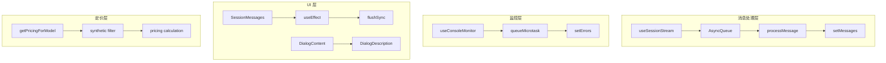

# Design Document: Fangyu Code Error Fixes

## Overview

本设计文档描述了 Fangyu Code v2.6.0 控制台错误和警告的系统性修复方案。修复涵盖消息重复、React 渲染警告、可访问性问题和性能优化等多个方面。

## Architecture

### 修复架构图



## Components and Interfaces

### 1. 消息去重系统增强

**问题根因**：消息通过 `enqueue` 加入 AsyncQueue，同时通过 `processMessage` 直接处理，导致重复。

**修复方案**：
```typescript
// src/hooks/useSessionStream.ts
// 移除直接调用 processMessage，改为只通过 AsyncQueue 处理

const outputUnlisten = await listen<string>(
  `${eventPrefix}-output:${sessionId}`,
  async (event) => {
    const result = converterRegistry.convertLine(event.payload, engine);
    if (result.message) {
      // 只加入队列，不直接处理
      messageQueueRef.current?.enqueue(result.message);
    }
  },
);

// 添加队列消费者
useEffect(() => {
  const consumeQueue = async () => {
    if (!messageQueueRef.current) return;
    for await (const message of messageQueueRef.current) {
      await processMessage(message, JSON.stringify(message));
    }
  };
  consumeQueue();
}, [processMessage]);
```

### 2. 渲染期间状态更新修复

**问题根因**：`useConsoleMonitor` 的 `addError` 在渲染期间同步调用 `setErrors`。

**修复方案**（已在代码中实现）：
```typescript
// src/hooks/useConsoleMonitor.ts - 第 169 行
const addError = useCallback(
  (type: "error" | "warn" | "info", args: any[]) => {
    // ... 分析错误逻辑 ...
    
    // 使用 queueMicrotask 延迟状态更新
    queueMicrotask(() => {
      setErrors((prev) => {
        // ... 现有逻辑 ...
      });
    });
  },
  [maxErrors]
);
```

### 3. flushSync 警告修复

**问题根因**：`SessionMessages` 组件在生命周期方法中调用 `flushSync`。

**修复方案**：
```typescript
// src/components/session/SessionMessages.tsx
// 将 flushSync 移到 useEffect 或 queueMicrotask 中

// 修改前（问题代码）
const scrollToBottom = () => {
  flushSync(() => {
    // 滚动逻辑
  });
};

// 修改后
const scrollToBottom = () => {
  queueMicrotask(() => {
    flushSync(() => {
      // 滚动逻辑
    });
  });
};
```

### 4. DialogContent 可访问性修复

**修复方案**：为所有 DialogContent 添加 DialogDescription 或 aria-describedby。

```typescript
// 修复模式
import { DialogDescription } from "@/components/ui/dialog";
import { VisuallyHidden } from "@radix-ui/react-visually-hidden";

// 方案 A：添加可见描述
<DialogContent>
  <DialogHeader>
    <DialogTitle>标题</DialogTitle>
    <DialogDescription>对话框描述文本</DialogDescription>
  </DialogHeader>
  {/* 内容 */}
</DialogContent>

// 方案 B：添加隐藏描述（仅供屏幕阅读器）
<DialogContent aria-describedby={undefined}>
  <DialogHeader>
    <DialogTitle>标题</DialogTitle>
  </DialogHeader>
  <VisuallyHidden>
    <DialogDescription>屏幕阅读器描述</DialogDescription>
  </VisuallyHidden>
  {/* 内容 */}
</DialogContent>
```

### 5. Tooltip ref 警告修复

**修复方案**：使用 `React.forwardRef` 包装 Tooltip 子组件。

```typescript
// 修复前
const TooltipChild = ({ children }) => <span>{children}</span>;

// 修复后
const TooltipChild = React.forwardRef<HTMLSpanElement, Props>(
  ({ children }, ref) => <span ref={ref}>{children}</span>
);
```

### 6. Unknown model 定价修复

**修复方案**：
```typescript
// src/lib/pricing.ts
export function getPricingForModel(model?: string, engine?: string): ModelPricing {
  if (!model) {
    return getDefaultPricing(engine);
  }

  // 过滤 synthetic 模型
  if (model === '<synthetic>' || model.includes('synthetic')) {
    return MODEL_PRICING["default"]; // 静默返回默认定价
  }

  // ... 现有逻辑 ...

  // 使用 debug 级别日志，并添加去重
  if (!warnedModels.has(model)) {
    warnedModels.add(model);
    console.debug(`[pricing] Unknown model: '${model}'. Using default pricing.`);
  }
  return MODEL_PRICING["default"];
}

// 模块级别的警告去重 Set
const warnedModels = new Set<string>();
```

### 7. Token 超限警告优化

**修复方案**：
```typescript
// src/hooks/useSessionThresholdMonitor.ts
const lastWarningTimeRef = useRef<number>(0);
const WARNING_INTERVAL = 60000; // 1 分钟

useEffect(() => {
  const currentTokens = estimateTokenCount(messages);
  const percentage = currentTokens / config.maxContextTokens;

  // 添加防抖：每分钟最多警告一次
  const now = Date.now();
  if (percentage > 1.0 && now - lastWarningTimeRef.current > WARNING_INTERVAL) {
    lastWarningTimeRef.current = now;
    console.warn(
      `[useSessionThresholdMonitor] ⚠️ Token usage exceeds 100%:`,
      `\n  Current tokens: ${currentTokens.toLocaleString()}`,
      `\n  Max tokens: ${config.maxContextTokens.toLocaleString()}`,
      `\n  Percentage: ${(percentage * 100).toFixed(1)}%`
    );
  }
  // ... 其余逻辑 ...
}, [messages, config, estimateTokenCount]);
```

### 8. 更新检查失败处理

**修复方案**：
```typescript
// src/lib/updater.ts
const MAX_RETRIES = 3;
const INITIAL_DELAY = 1000;

async function checkForUpdates(): Promise<UpdateInfo | null> {
  let lastError: Error | null = null;
  
  for (let attempt = 0; attempt < MAX_RETRIES; attempt++) {
    try {
      const response = await fetch(UPDATE_URL);
      if (!response.ok) throw new Error(`HTTP ${response.status}`);
      return await response.json();
    } catch (error) {
      lastError = error as Error;
      console.debug(`[Updater] Attempt ${attempt + 1} failed:`, error);
      
      if (attempt < MAX_RETRIES - 1) {
        const delay = INITIAL_DELAY * Math.pow(2, attempt);
        await new Promise(resolve => setTimeout(resolve, delay));
      }
    }
  }
  
  // 所有重试失败
  console.error('[Updater] All retries failed:', lastError);
  return null; // 静默失败，不显示错误给用户
}
```

### 9. 异常增量警告优化

**修复方案**：
```typescript
// src/hooks/useHourlyUsageTracker.ts
const MAX_REASONABLE_DELTA = 100000; // 10 万 tokens

const recordUsage = useCallback((delta: UsageDelta) => {
  // 检测异常增量
  if (delta.tokensDelta > MAX_REASONABLE_DELTA) {
    console.warn(
      `[useHourlyUsageTracker] ⚠️ 异常大的增量，已限制:`,
      `\n  原始值: ${delta.tokensDelta}`,
      `\n  限制为: ${MAX_REASONABLE_DELTA}`,
      `\n  来源: ${delta.source || 'unknown'}`
    );
    delta.tokensDelta = MAX_REASONABLE_DELTA;
  }
  
  // ... 记录逻辑 ...
}, []);
```

### 10. 摘要生成失败处理

**修复方案**：
```typescript
// src/lib/sessionSummarizer.ts
async function generateSummary(messages: Message[]): Promise<string> {
  try {
    const result = await api.generateTextWithLLM(prompt, "haiku");
    return result;
  } catch (error) {
    // 详细错误日志
    console.error('[SessionSummarizer] Failed to generate summary:', {
      error,
      errorType: typeof error,
      errorMessage: error instanceof Error ? error.message : String(error),
      errorStack: error instanceof Error ? error.stack : undefined,
      messagesCount: messages.length,
      inputLength: prompt.length,
    });
    
    // 用户友好的回退消息
    return '摘要生成失败，请稍后重试。';
  }
}
```

## Data Models

### ConsoleError 增强

```typescript
interface ConsoleError {
  id: string;
  type: "error" | "warn" | "info";
  message: string;
  stack?: string;
  timestamp: number;
  count: number;
  category: ErrorCategory;
  suggestion?: string;
  file?: string;
  line?: number;
  // 新增字段
  source?: string;        // 错误来源组件
  isDeferred?: boolean;   // 是否已延迟处理
}
```

### ThresholdStatus 增强

```typescript
interface ThresholdStatus {
  currentTokens: number;
  percentage: number;
  isWarning: boolean;
  isCritical: boolean;
  isGeneratingSummary: boolean;
  // 新增字段
  lastWarningTime?: number;  // 上次警告时间
  warningCount?: number;     // 警告次数
}
```

## Correctness Properties

*A property is a characteristic or behavior that should hold true across all valid executions of a system—essentially, a formal statement about what the system should do. Properties serve as the bridge between human-readable specifications and machine-verifiable correctness guarantees.*

### Property 1: Message Uniqueness

*For any* stream of messages processed by the Message_Deduplication_System, each message with a unique ID SHALL appear exactly once in the output, regardless of how many times it was received.

**Validates: Requirements 1.1, 1.2, 1.5**

### Property 2: Render-Safe State Updates

*For any* error detected during component rendering, the Console_Monitor SHALL defer the state update to the next microtask, ensuring no synchronous state updates occur during render.

**Validates: Requirements 2.1, 2.2, 2.3, 2.4**

### Property 3: Dialog Accessibility

*For any* DialogContent component in the application, it SHALL have either a DialogDescription child or an aria-describedby attribute, ensuring screen reader compatibility.

**Validates: Requirements 4.1, 4.2, 4.3, 4.4**

### Property 4: Pricing System Robustness

*For any* model identifier passed to getPricingForModel, the function SHALL return a valid ModelPricing object without throwing, and synthetic models SHALL be handled silently without warnings.

**Validates: Requirements 6.1, 6.2, 6.3**

### Property 5: Threshold Warning Rate Limiting

*For any* sequence of token usage updates that exceed the threshold, the Threshold_Monitor SHALL log at most one warning per minute, while still accurately tracking the threshold state.

**Validates: Requirements 7.1, 7.2, 7.3**

### Property 6: Usage Tracking Accuracy

*For any* sequence of usage deltas including abnormal values, the Usage_Tracker SHALL maintain accurate cumulative statistics by capping abnormal values and logging the anomaly source.

**Validates: Requirements 9.1, 9.2, 9.3**

## Error Handling

### 错误处理策略

| 错误类型 | 处理策略 | 用户反馈 |
|---------|---------|---------|
| 消息重复 | 静默去重 | 无 |
| 渲染状态更新 | 延迟到 microtask | 无 |
| flushSync 警告 | 延迟调用 | 无 |
| 可访问性缺失 | 添加描述 | 无 |
| 未知模型 | 使用默认定价 | debug 日志 |
| Token 超限 | 限流警告 | 控制台警告 |
| 更新检查失败 | 重试 + 静默失败 | 无 |
| 异常增量 | 限制值 + 警告 | 控制台警告 |
| 摘要生成失败 | 详细日志 + 回退 | 友好提示 |

## Testing Strategy

### 单元测试

- 测试 `useMessageDeduplication` 的去重逻辑
- 测试 `useConsoleMonitor` 的 queueMicrotask 延迟
- 测试 `getPricingForModel` 的 synthetic 模型处理
- 测试 `useSessionThresholdMonitor` 的警告限流

### 属性测试

使用 `fast-check` 库进行属性测试：

```typescript
import * as fc from 'fast-check';

// Property 1: Message Uniqueness
test('messages with same ID should be deduplicated', () => {
  fc.assert(
    fc.property(
      fc.array(fc.record({
        id: fc.string(),
        content: fc.string(),
      })),
      (messages) => {
        const result = deduplicateMessages(messages);
        const ids = result.map(m => m.id);
        const uniqueIds = new Set(ids);
        return ids.length === uniqueIds.size;
      }
    ),
    { numRuns: 100 }
  );
});

// Property 4: Pricing System Robustness
test('getPricingForModel should never throw', () => {
  fc.assert(
    fc.property(
      fc.oneof(fc.string(), fc.constant(undefined)),
      fc.oneof(fc.constant('claude'), fc.constant('codex'), fc.constant('gemini'), fc.constant(undefined)),
      (model, engine) => {
        const result = getPricingForModel(model, engine);
        return result !== null && 
               typeof result.input === 'number' &&
               typeof result.output === 'number';
      }
    ),
    { numRuns: 100 }
  );
});
```

### 集成测试

- 测试完整的消息流处理流程
- 测试 Dialog 组件的可访问性
- 测试更新检查的重试逻辑
