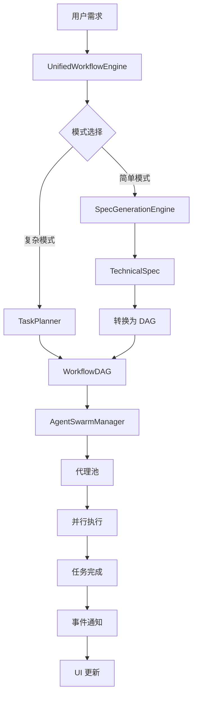

# Design Document: Unified Workflow System

## Overview

统一工作流系统（Unified Workflow System）合并了两套现有实现的优势：

| 来源 | 优势 | 保留 |
|------|------|------|
| WorkflowManagerPanel (Kiro 风格) | SpecGenerationEngine 规范生成 | ✅ |
| useWorkflowOrchestrator (Devin 风格) | TaskPlanner DAG 分解、AgentSwarmManager 并行执行、暂停/恢复控制 | ✅ |

### 设计目标

1. **统一入口**: 单一 Hook (`useUnifiedWorkflow`) 管理完整工作流生命周期
2. **智能规划**: 结合 SpecGenerationEngine 和 TaskPlanner 的能力
3. **并行执行**: 利用 AgentSwarmManager 的多代理并行调度
4. **完整控制**: 支持暂停/恢复/重试/取消操作
5. **事件驱动**: EventEmitter 模式实现 UI 实时更新
6. **API 兼容**: 支持 HiAPI、hone.vvvv.ee 等 OpenAI 兼容端点

## Architecture

```
┌─────────────────────────────────────────────────────────────────────┐
│                        useUnifiedWorkflow                           │
│                        (React Hook 入口)                            │
├─────────────────────────────────────────────────────────────────────┤
│                                                                     │
│  ┌─────────────────────────────────────────────────────────────┐   │
│  │                 UnifiedWorkflowEngine                        │   │
│  │                 (核心协调引擎)                                │   │
│  ├─────────────────────────────────────────────────────────────┤   │
│  │                                                              │   │
│  │  ┌──────────────────┐    ┌──────────────────┐               │   │
│  │  │ SpecGeneration   │    │   TaskPlanner    │               │   │
│  │  │ Engine           │───▶│                  │               │   │
│  │  │ (需求→规范)       │    │ (规范→DAG)       │               │   │
│  │  └──────────────────┘    └────────┬─────────┘               │   │
│  │                                   │                          │   │
│  │                                   ▼                          │   │
│  │                    ┌──────────────────────────┐              │   │
│  │                    │   AgentSwarmManager      │              │   │
│  │                    │   (多代理并行调度)        │              │   │
│  │                    └──────────────────────────┘              │   │
│  │                                                              │   │
│  └─────────────────────────────────────────────────────────────┘   │
│                                                                     │
│  Events: workflow:*, task:*, agent:*                               │
│                                                                     │
└─────────────────────────────────────────────────────────────────────┘
```

### 数据流



## Components and Interfaces

### 1. UnifiedWorkflowEngine (核心引擎)

```typescript
interface UnifiedWorkflowEngine {
  // 配置
  config: UnifiedWorkflowConfig;
  
  // 状态
  state: WorkflowState;
  workflow: WorkflowDAG | null;
  
  // 生命周期
  initialize(): Promise<void>;
  destroy(): Promise<void>;
  
  // 工作流操作
  generateWorkflow(requirement: string, options?: GenerateOptions): Promise<WorkflowDAG>;
  startExecution(): Promise<void>;
  pauseExecution(): void;
  resumeExecution(): Promise<void>;
  cancelExecution(): void;
  retryTask(taskId: string): Promise<void>;
  
  // 事件
  on(event: WorkflowEventType, handler: EventHandler): void;
  off(event: WorkflowEventType, handler: EventHandler): void;
  emit(event: WorkflowEventType, data: any): void;
}
```

### 2. useUnifiedWorkflow (React Hook)

```typescript
interface UseUnifiedWorkflowReturn {
  // 状态
  state: 'idle' | 'planning' | 'executing' | 'paused' | 'completed' | 'failed';
  workflow: WorkflowDAG | null;
  agents: Agent[];
  progress: WorkflowProgress;
  logs: WorkflowLog[];
  error: string | null;
  
  // 操作
  generateWorkflow: (requirement: string) => Promise<WorkflowDAG>;
  startWorkflow: () => Promise<void>;
  pauseWorkflow: () => void;
  resumeWorkflow: () => Promise<void>;
  cancelWorkflow: () => void;
  retryTask: (taskId: string) => Promise<void>;
  
  // 查询
  getTaskStatus: (taskId: string) => Task | undefined;
  getAgentStatus: (agentId: string) => Agent | undefined;
}

interface WorkflowProgress {
  totalTasks: number;
  completedTasks: number;
  failedTasks: number;
  currentTask: Task | null;
  percentage: number;
}
```

### 3. UnifiedWorkflowConfig (配置)

```typescript
interface UnifiedWorkflowConfig {
  // API 配置
  api: {
    key: string;
    baseUrl: string;
    model: string;
  };
  
  // 代理配置
  agents: {
    maxAgents: number;
    maxConcurrentTasks: number;
  };
  
  // 执行配置
  execution: {
    taskTimeout: number;
    maxRetries: number;
    retryDelay: number;
  };
  
  // 模式配置
  mode: 'simple' | 'advanced';
}
```

## Data Models

### WorkflowDAG (工作流有向无环图)

```typescript
interface WorkflowDAG {
  metadata: WorkflowMetadata;
  tasks: Task[];
  edges: WorkflowEdge[];
  parallelGroups: string[][];
  entryPoints: string[];
  exitPoints: string[];
}

interface WorkflowMetadata {
  id: string;
  name: string;
  description: string;
  version: string;
  createdAt: number;
  updatedAt: number;
  complexity: 'simple' | 'moderate' | 'complex' | 'extreme';
  criticalPath: string[];
  estimatedTotalTime: number;
}
```

### Task (任务)

```typescript
interface Task {
  id: string;
  description: string;
  type: 'sequential' | 'parallel' | 'conditional';
  priority: 'low' | 'medium' | 'high' | 'critical';
  status: 'pending' | 'in_progress' | 'completed' | 'failed' | 'cancelled';
  progress: number;
  dependencies: string[];
  dependents: string[];
  assignedAgentId?: string;
  result?: TaskResult;
  metrics: TaskMetrics;
}

interface TaskMetrics {
  startTime?: number;
  endTime?: number;
  duration?: number;
  retryCount: number;
}
```

### Agent (代理)

```typescript
interface Agent {
  id: string;
  name: string;
  type: AgentType;
  status: 'idle' | 'busy' | 'error';
  capabilities: AgentCapabilities;
  currentTask?: Task;
  performance: AgentPerformance;
}

type AgentType = 
  | 'orchestrator' 
  | 'planner' 
  | 'frontend' 
  | 'backend' 
  | 'testing' 
  | 'devops' 
  | 'review' 
  | 'docs'
  | 'general';
```

### WorkflowEvent (事件)

```typescript
interface WorkflowEvent {
  type: WorkflowEventType;
  timestamp: number;
  data: any;
  taskId?: string;
  agentId?: string;
}

type WorkflowEventType =
  | 'workflow:started'
  | 'workflow:paused'
  | 'workflow:resumed'
  | 'workflow:completed'
  | 'workflow:failed'
  | 'workflow:cancelled'
  | 'task:started'
  | 'task:progress'
  | 'task:completed'
  | 'task:failed'
  | 'task:cancelled'
  | 'agent:created'
  | 'agent:assigned'
  | 'agent:idle'
  | 'agent:destroyed';
```

## Correctness Properties

*A property is a characteristic or behavior that should hold true across all valid executions of a system—essentially, a formal statement about what the system should do. Properties serve as the bridge between human-readable specifications and machine-verifiable correctness guarantees.*

### Property 1: DAG Validity
*For any* WorkflowDAG generated by the system, the graph SHALL be a valid directed acyclic graph with no circular dependencies.

**Validates: Requirements 1.2, 2.2**

### Property 2: Parallel Task Identification
*For any* set of tasks in a WorkflowDAG where no task depends on another task in the set, those tasks SHALL be identified as parallelizable and appear in parallelGroups.

**Validates: Requirements 1.3, 2.4**

### Property 3: Critical Path Correctness
*For any* WorkflowDAG, the critical path SHALL be the longest path from any entry point to any exit point, measured by task complexity.

**Validates: Requirements 2.3**

### Property 4: Agent-Task Matching
*For any* task assigned to an agent, the agent's capabilities SHALL include at least one skill or tool required by the task, OR the agent SHALL be of type 'general'.

**Validates: Requirements 3.2**

### Property 5: Concurrency Limit
*For any* workflow execution, the number of simultaneously executing tasks SHALL never exceed the configured maxConcurrentTasks limit.

**Validates: Requirements 3.3**

### Property 6: Agent Pool Lifecycle
*For any* agent that completes a task, the agent SHALL transition to 'idle' status and be available in the pool for new task assignments.

**Validates: Requirements 3.1, 3.4**

### Property 7: Task Queue Preservation
*For any* task that cannot be assigned due to no available agents, the task SHALL remain in the queue and not be dropped or lost.

**Validates: Requirements 3.5**

### Property 8: Pause/Resume Round-Trip
*For any* workflow that is paused and then resumed, the workflow state after resume SHALL be equivalent to the state at pause, and execution SHALL continue from the last completed task.

**Validates: Requirements 4.1, 4.2, 4.3**

### Property 9: Retry Isolation
*For any* failed task that is retried, the retry SHALL only affect the failed task and its dependents, not any previously completed tasks.

**Validates: Requirements 4.4**

### Property 10: Cancellation Cleanup
*For any* workflow that is cancelled, all running tasks SHALL be stopped and all allocated resources (agents, sandboxes) SHALL be released.

**Validates: Requirements 4.5**

### Property 11: Event Emission Completeness
*For any* state change in the workflow (started, paused, resumed, completed, failed, cancelled), a corresponding event SHALL be emitted with accurate timestamp and data.

**Validates: Requirements 4.6, 7.1-7.5**

### Property 12: Event Subscription Correctness
*For any* event subscriber, the subscriber SHALL receive all events of the subscribed type, and after unsubscribing, SHALL receive no further events.

**Validates: Requirements 7.6**

### Property 13: Progress Accuracy
*For any* workflow in execution, the progress percentage SHALL equal (completedTasks / totalTasks) * 100, and completedTasks + failedTasks + pendingTasks + inProgressTasks SHALL equal totalTasks.

**Validates: Requirements 5.4**

### Property 14: Hook Cleanup
*For any* React component using useUnifiedWorkflow that unmounts, all event listeners SHALL be removed and no memory leaks SHALL occur.

**Validates: Requirements 5.6**

## Error Handling

### API 错误

| 错误类型 | 处理方式 |
|---------|---------|
| API Key 缺失 | 显示配置指引，提示用户设置 API Key |
| API 请求失败 | 重试 3 次，指数退避，最终显示错误详情 |
| 响应解析失败 | 返回 fallback 规范，记录错误日志 |

### 任务执行错误

| 错误类型 | 处理方式 |
|---------|---------|
| 任务超时 | 标记失败，触发重试机制 |
| 代理执行失败 | 记录错误，尝试分配其他代理 |
| 依赖任务失败 | 标记依赖任务为 blocked，等待重试 |

### 状态恢复

- 工作流状态持久化到 localStorage
- 支持页面刷新后恢复执行
- 异常退出后可从最后检查点恢复

## Testing Strategy

### 单元测试

| 组件 | 测试重点 |
|------|---------|
| UnifiedWorkflowEngine | 状态转换、事件发射、错误处理 |
| TaskPlanner | DAG 生成、依赖分析、关键路径计算 |
| AgentSwarmManager | 代理池管理、任务分配、并发控制 |
| useUnifiedWorkflow | Hook 状态管理、cleanup、re-render |

### 属性测试

使用 **fast-check** 库进行属性测试：

```typescript
import fc from 'fast-check';

// Property 1: DAG Validity
test('generated DAG should have no cycles', () => {
  fc.assert(
    fc.property(
      fc.string({ minLength: 10, maxLength: 500 }), // requirement
      async (requirement) => {
        const dag = await engine.generateWorkflow(requirement);
        return !hasCycle(dag);
      }
    ),
    { numRuns: 100 }
  );
});
```

### 测试配置

- 属性测试最少运行 100 次迭代
- 每个属性测试标注对应的设计属性编号
- 使用 mock API 避免真实 API 调用
- 测试覆盖率目标：80%+

### 测试文件结构

```
src/
├── core/
│   └── workflow/
│       ├── UnifiedWorkflowEngine.ts
│       ├── UnifiedWorkflowEngine.test.ts      # 单元测试
│       └── UnifiedWorkflowEngine.property.test.ts  # 属性测试
├── hooks/
│   └── useUnifiedWorkflow.ts
│   └── useUnifiedWorkflow.test.ts
```
